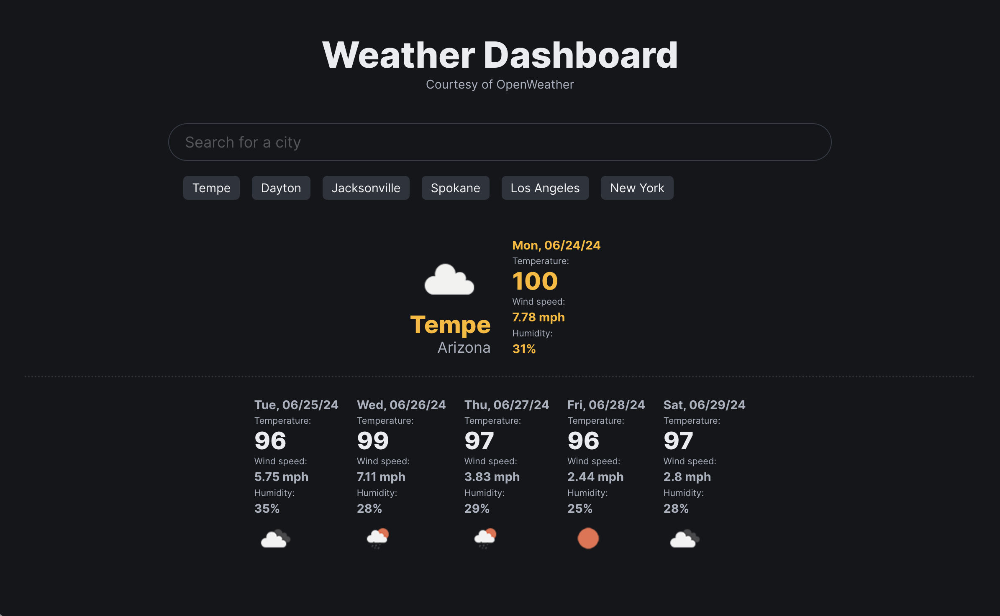

# Weather Dashboard

## Description

For this project the goal was to build a Web Application that would harness the power of OpenWeather's API to fetch a Weather Forecast.

Upon fetching the data from OpenWeather it must be navigated and organized so that it can be presented in a way that is useful to the user.

Some additional functionalities included utilizing Local Storage to maintain a list of recent searches.

I have employed Bulma CSS Framework for the styling of this Web Application.

## User Story

```
AS A traveler,
I WANT to be able to easily review weather upon searching city names,
SO THAT I can plan accordingly,
WHEN I search for a city, I expect there to be some persistence to this data,
WHEN I access the Weather Dashboard again on subsequent visits,
I WANT to be able to see my recent searches.
```

## Preview

The following image shows the web application's appearance and functionality:



## Credits

- [OpenWeather](https://openweathermap.org/)
- [Bulma](https://bulma.io/)
- [Julienne Knowles](https://github.com/jknowles10)
- [Ken Wagner](https://github.com/horizonbound0/)
- [MDN Web Docs](https://developer.mozilla.org/en-US/)
- [W3Schools](https://www.w3schools.com/)
- The Coding Boot Camp at UT Austin